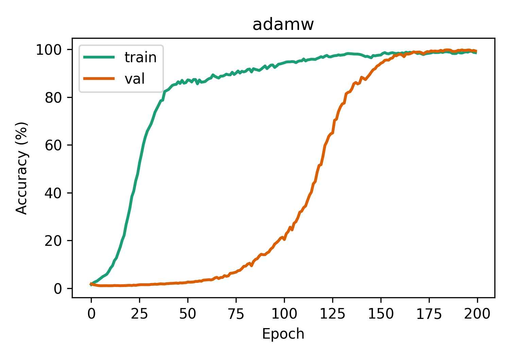
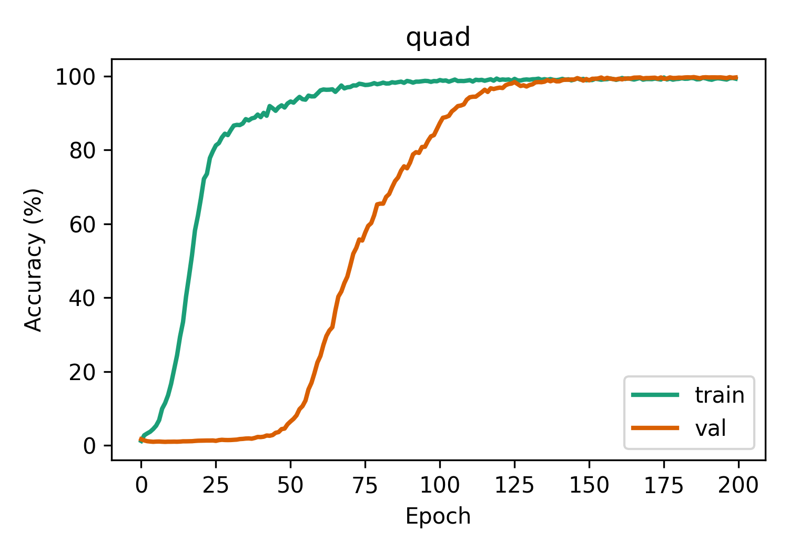

# Grokking Modular Arithmetic

## PSGD-QUAD vs AdamW

### QUAD Summary

QUAD is a new variant of PSGD that has a matmul-only preconditioner update, so it is 
fast enough to update every train step (only ~5 matmuls per dense preconditioner per step).

- Saves preconditioner state step-to-step, solving the problem adaptively over time.
- Can handle any size or dimension tensor from 0-D to N-D.
- Preconditions multiple dimensions.
- Can precondition a dimension with either a dense (m, m) or diagonal (m,) preconditioner, saving memory.

## Optimizer Sweeps

Note: lowered train fraction from 0.5 to 0.4 to make problem slightly harder.

Tuned in:

```python
lr = [3e-3, 1e-3, 3e-4]
wd = [0.0, 0.001, 0.01, 0.1, 0.3]
b1 = [0.9, 0.95]
```

Best QUAD: `lr=3e-3, wd=0.3, b1=0.9`

Best AdamW: `lr=3e-3, wd=0.3, b1=0.9, b2=0.99`

**AdamW:**
<p align="center">
  
</p>

**PSGD-QUAD:**
<p align="center">
  
</p>

## Architecture Sweeps

**Dimension Sweep:**
<p align="center">
  
</p>

**Depth Sweep:**
<p align="center">
  
</p>

**Heads Sweep:**
<p align="center">
  
</p>

**Dropout Sweep:**
<p align="center">
  
</p>

## Grokking

<p align="center">
  
</p>
<p align="center">
  
</p>

_Grokking_: a phenomenon observed in neural nets, where after an initial phase of overfitting (or memorization), the model suddenly achieves perfect generalization, inspired by [Power et al. (2022)](https://arxiv.org/abs/2201.02177). We incorporate some modern Transformer tricks (e.g., RoPE, RMSNorm, SiLU, etc.) and achieve grokking in < 150 epochs on modular division when $p=97$ on 50% of the training data using a 2 layer, 1 head, 128 dim net.

## Background

We define modular arithmetic for the following operations given a prime modulus $p$ and $(a, b)$ for $0 \leq a \lt p, 0 \lt b \lt p$:
- **Addition**: $a \circ b = a + b \mod p$
- **Subtraction**: $a \circ b = a - b \mod p$
- **Multiplication**: $a \circ b = a \cdot b \mod p$
- **Division**: $a \circ b = a / b \mod p$, using Fermat’s Little Theorem which states that $b^{p-1} \equiv 1 \mod p$ for any $b$ not divisible by $p$.

## Running

Run with default params for $a / b \mod p$ and save the result in [`media/grokking.png`](media/grokking.png):
```bash
python main.py
```
- **`main.py`**: training and evaluation loops
- **`models.py`**: defines the Transformer model
- **`data.py`**: generate the dataset

## Dependencies

Install the dependencies (optimized for Apple silicon; yay for [MLX](https://github.com/ml-explore/mlx)!):
```bash
pip install -r requirements.txt
```
